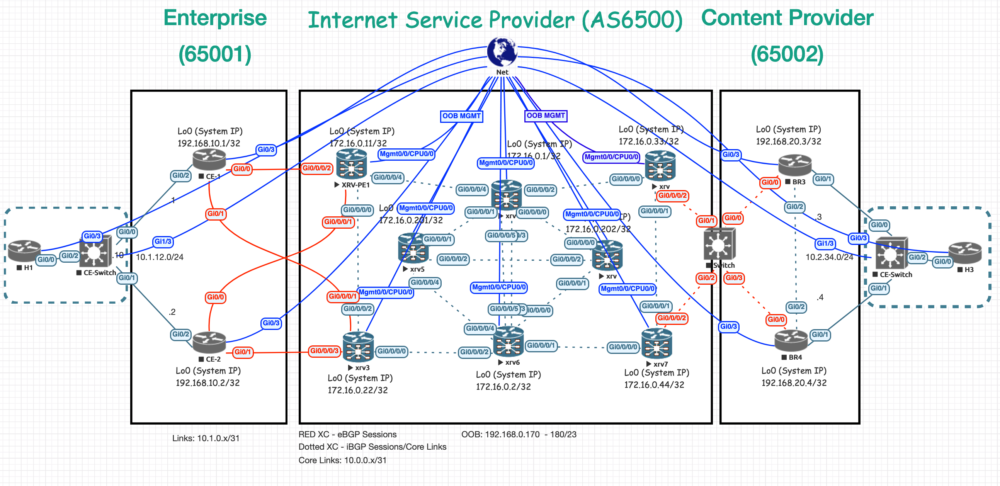

# MPLS in the SDN Era --> DevNet SPAUTO
## A lab topology based on MPLS in the SDN era book used for 300-535 SPAUTO studies.

## Why MPLS in the SDN Era?
Simple. This is an incredible book for any and all Network Engineers interested
in learning technologies used in Service Provider environments. The book is heavily focused 
on MPLS, SDN, Segment-Routing, BGP, L2VPN/L3VPNs, over-all traffic engineering and much more. These are common terms within SP networks and the book does an incredible job in guiding the audience while exploring the device configurations in this topology.

This book goes through a number of device configurations in a multi-vendor lab topology
(Cisco IOSXR && Juniper)

*For this lab, all devices have been replaced with Cisco-IOSXR/XE as we are working on a 
Cisco Certification.*

## Authors of the book:
 - Antonio Sanchez Monge (Author)
 - Krzysztof Grzegorz Szarkowicz (Author) 

### To fully automate Service Provider Networks, you must understand Service Provider Networks.

[Get the book](https://www.amazon.com/MPLS-SDN-Era-Interoperable-Scenarios/dp/149190545X/ref=sr_1_1?dchild=1&keywords=mpls+in+the+sdn+era&qid=1618100065&s=books&sr=1-1)

# What does this repository include & cover?

My goal is to gather all of my self-training to fully in this repostiroy and cover all the major 
Cisco Certified DevNet Specialist (300-535 SPAUTO) topics. However, the focus will be heavily on 
NSO.

## Extras:
    There will be some extra material in this repository that can be an aid for other areas, including but not limited to:
        - Batfish
        - Nornir

# How to use this to study?

It would be expected for you to have access to a virtual lab environment that can run this 
topology. 
    There are a total of 17 devices running in the lab scenario.
    8 of them are IOSXR devices, which can consume up to 3GB each.

A local or remote instance of NSO running to take advantage of all of the scripts.

A wiki will be created with study notes, material, etc.

Explore the content, break the scripts and have fun with it. 

TODO: "breakout sections for each major topic"